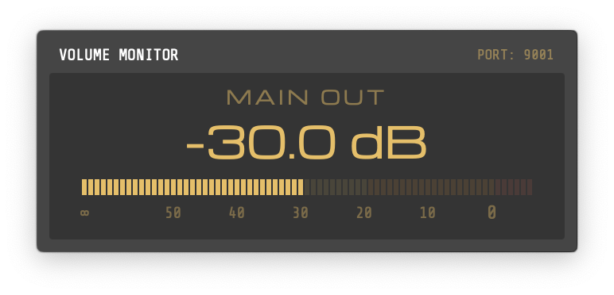
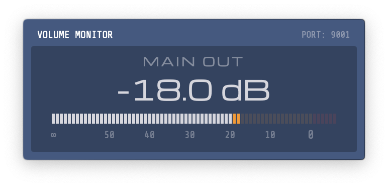
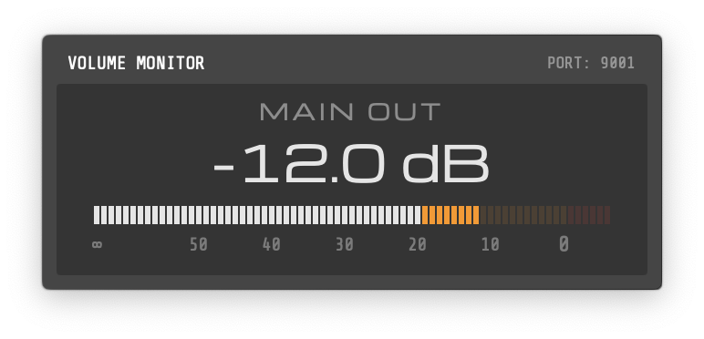
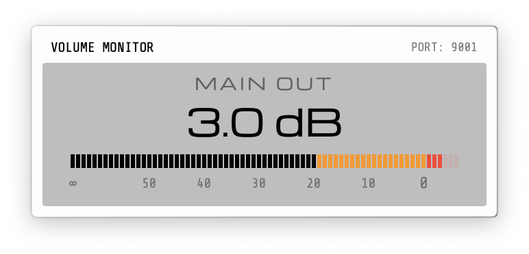

# TM-OSC-HUD

## Overview

A macOS utility that provides a heads-up display (HUD) for RME TotalMix main volume. It is designed to provide visual feedback when using hardware controllers, such as the RME ARC USB, to adjust volume.

## Configuration

The application acts as an OSC server and listens for volume data on a specific port and address.

* **Default Port**: 9001
* **Default Address**: /1/mastervolumeVal

## Installation and Setup

1. Open TotalMix and in the toolbar select Options -> Mixer Settings... and go to the OSC tab
2. Set the Remote Controller Address Host to 127.0.0.1 and the outgoing Port to 9001 (or whatever you'd like).
4. Enable OSC Control from the Options toolbar.
5. Launch TM-OSC-HUD; the HUD will appear automatically when the Main Volume is changed.

